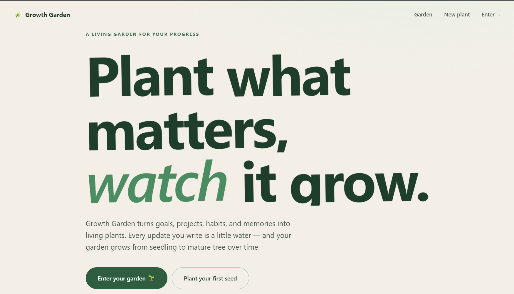

# 🌿 Growth Garden

Growth Garden is a visual journaling and personal growth platform that transforms goals, projects, habits, and memories into living plants inside a digital garden.

Instead of tracking progress through spreadsheets, checklists, or productivity dashboards, Growth Garden encourages reflection through growth. Every plant represents something meaningful in your life. Every update acts as water. Every milestone helps your garden flourish.

As you continue documenting your journey, plants evolve from tiny seedlings into mature trees, creating a visual representation of your progress over time.

Built with Flask, SQLite, SQLAlchemy, and handcrafted CSS, Growth Garden is designed to be peaceful, personal, and distraction-free.

---

## ✨ Why Growth Garden?

Most productivity applications focus on tasks.

Growth Garden focuses on journeys.

Whether you're:

* Learning a new skill
* Building a project
* Developing a habit
* Preserving meaningful memories

Growth Garden provides a space where progress becomes something you can actually watch grow.

---

## 🌱 Core Features

### 🌟 Structured Garden Beds

Plants are organized into dedicated garden areas:

* 🌟 Goals
* 📚 Projects
* 💪 Habits
* 📸 Memories

Each garden bed serves a different purpose while keeping your digital garden organized and easy to navigate.

---

### 🌳 Dynamic Plant Growth

Every plant evolves based on written updates.

Growth is calculated automatically:

| Updates | Stage          |
| ------- | -------------- |
| 0       | 🌱 Seedling    |
| 1–3     | 🌿 Sprout      |
| 4–7     | 🌳 Young Tree  |
| 8+      | 🌲 Mature Tree |

The more consistently you document your journey, the more your garden grows.

---

### 📝 Progress Journal

Every plant includes its own activity history.

Track:

* Progress updates
* Milestones
* Reflections
* Achievements

All entries are displayed in a clean chronological timeline.

---

### 📸 Photo Memories

Attach photos to any plant.

Examples:

* Project screenshots
* Fitness progress photos
* Travel memories
* Learning milestones

Photos are displayed inside a dedicated gallery while also appearing within the plant's activity timeline.

---

### 📈 Garden Insights

The dashboard provides a quick overview of your garden:

* Total Plants
* Total Updates
* Total Photos
* Mature Trees

Helping users understand their long-term progress at a glance.

---

### 🗑 Safe Deletion

Plants can be removed safely using confirmation dialogs.

Deleting a plant automatically removes:

* Related updates
* Photo memories
* Uploaded image files

Keeping the database and storage clean.

---

## 🎨 Design Philosophy

Growth Garden was designed around one simple idea:

> Progress should feel alive.

The interface avoids cluttered dashboards and aggressive productivity metrics in favor of a calm, nature-inspired experience.

Design principles include:

* Soft green and earth-tone palette
* Responsive layouts
* Consistent spacing system
* Smooth interactions
* Minimal visual noise
* Mobile-friendly experience

The result feels closer to a digital journal than a traditional productivity application.

---

## 🛠 Technology Stack

### Backend

* Flask
* SQLAlchemy
* SQLite

### Frontend

* HTML5
* Jinja2
* Custom CSS
* Vanilla JavaScript

### Storage

* Local image uploads
* SQLite database

---

## 🚀 Running Locally

### One-click (Windows)

Double-click **`run.bat`** — it finds Python, installs everything on first run, starts the server, and opens your browser automatically.

> Requires Python 3 (install from [python.org](https://www.python.org/downloads/) and tick **"Add Python to PATH"**).

### Manual setup

#### Create Virtual Environment

```bash
python -m venv .venv
```

Activate:

**Windows**

```bash
.venv\Scripts\Activate.ps1
```

**macOS / Linux**

```bash
source .venv/bin/activate
```

---

### Install Dependencies

```bash
pip install -r requirements.txt
```

---

### Launch Application

```bash
python app.py
```

Open:

http://127.0.0.1:5000

The database and default garden beds are automatically created during first launch.

---

## 📂 Project Structure

```text
growth_garden/

├── app.py
├── models.py
├── forms.py
├── requirements.txt
│
├── static/
│   ├── css/
│   ├── js/
│   ├── favicon.svg
│   └── uploads/
│
├── templates/
│   ├── base.html
│   ├── hero.html
│   ├── dashboard.html
│   ├── plant_detail.html
│   ├── create_plant.html
│   ├── add_update.html
│   ├── upload_photo.html
│   └── error.html
│
└── instance/
    └── garden.db
```

---

## 🎯 Project Goals

Growth Garden was built to explore how visual metaphors can make personal progress more engaging and meaningful.

Rather than measuring productivity through numbers alone, the application represents growth through living elements that evolve alongside the user's journey.

The result is a lightweight platform that combines journaling, habit tracking, project tracking, and memory preservation into a single digital garden.
